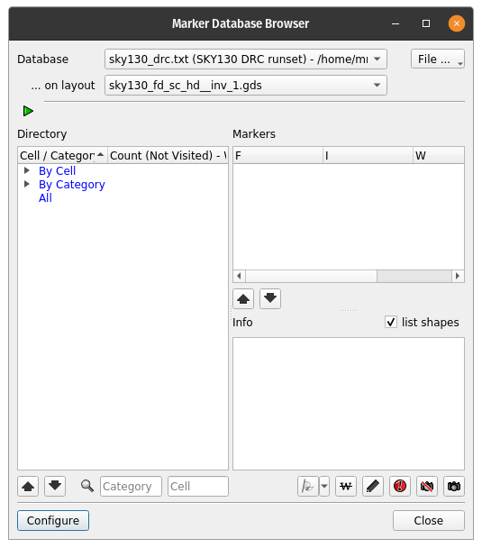
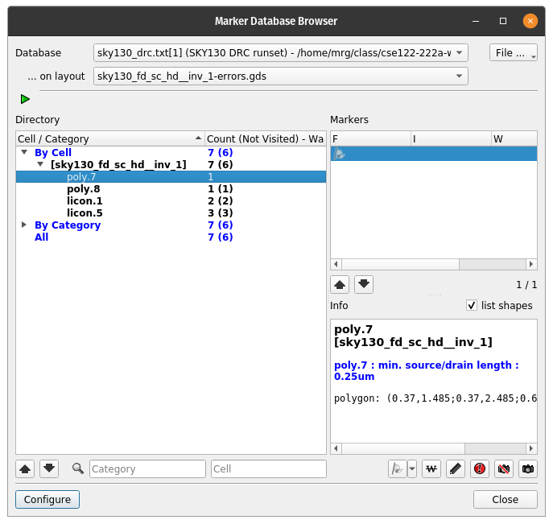
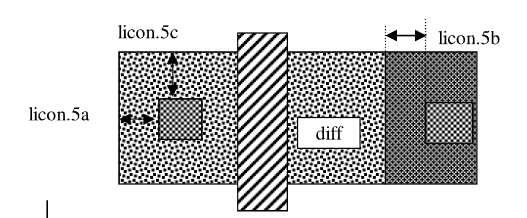

# Running DRC 

There are a few options for running DRC: 
- BEOL: "back-end of line" or device layer checks only
- FEOL: "front-end of line" or metal layer checks only
- Full: Both BEOL and FEOL checks.
- Custom: A custom set of DRC checks (BEOL, FEOL, grid, seal, etc.)

Sometimes, you might want to run just the FEOL checks to save run-time if, for
example, you are just checking the routing and you know your standard cells
pass DRC.

If you run DRC (Full), you wil get a window with the results like this:

which has the DRC errors (if any) categorized by the cell, type, etc. The
inverter should pass DRC with no errors.

If you load the "sky130_fd_sc_hd__inv_1-errors.gds" file, and run DRC, you should
see the following errors (after expanding the tabs):

Note that I resized the window and epanded the "Cell/Category" column to show the full
information.

If you click on a given error, it will open an explanation as well as highlight
the related error in the layout with a thin black line.

Detailed explanations of the DRC errors can be found in the 
[Sky130 Periphery Rules documentation](https://skywater-pdk.readthedocs.io/en/main/rules.html)

Typically, DRC rules are formulated by the layer and the rule number. 
We highlighted the poly.7 rule and can go to the poly section to see the details:

Specifically, poly.7 specifies the "Extension of diffusion beyond poly" or the minimum source/drain length.  
Poly.8 specifies the "Extension of poly beyond diffusion". Poly.7 should be 0.25um and poly.8 should be 0.13um.
(I don't know why the units are missing for these rules in the manual.)
If you look closely at the examples, there is an example of poly.7 and poly.8 with measurement markers:

In the example, there are also licon.1 and licon.5 errors which are available
in the [licon
section](https://skywater-pdk.readthedocs.io/en/main/rules/periphery.html#licon)
of the design rules. Licon.1 specifies the minimum and maximum contact size which must be 0.17um. Licon.5 
has several sub rules (a, b, and c) which can be seen most easily in the following image:

Basically, the contact needs to have space on the left/right or bottom/top of different size. Licon.5b
is related to licon in tap well taps and not diff.

# License

Copyright 2024 VLSI-DA (see [LICENSE](LICENSE) for use)
