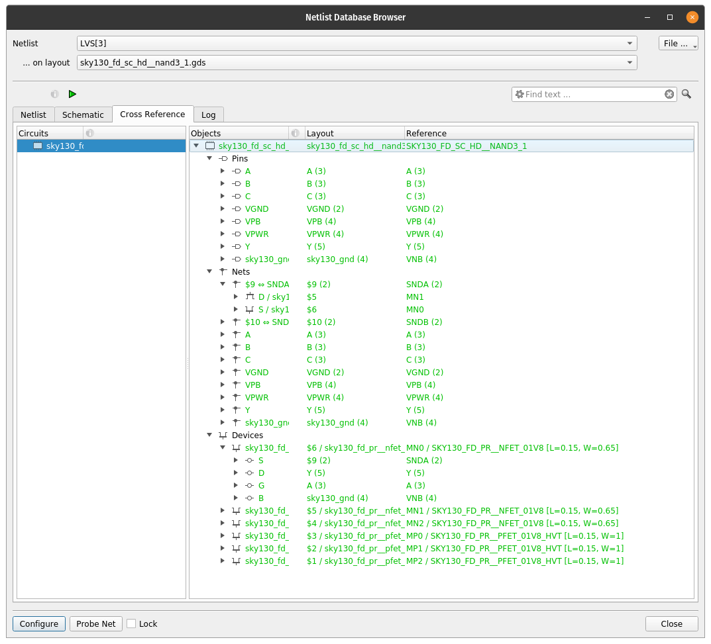
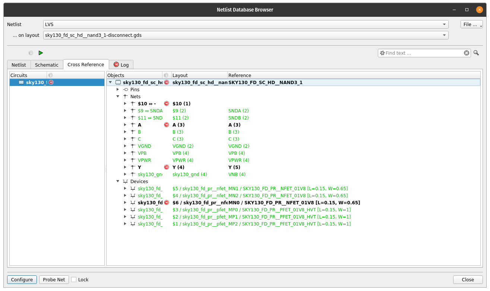
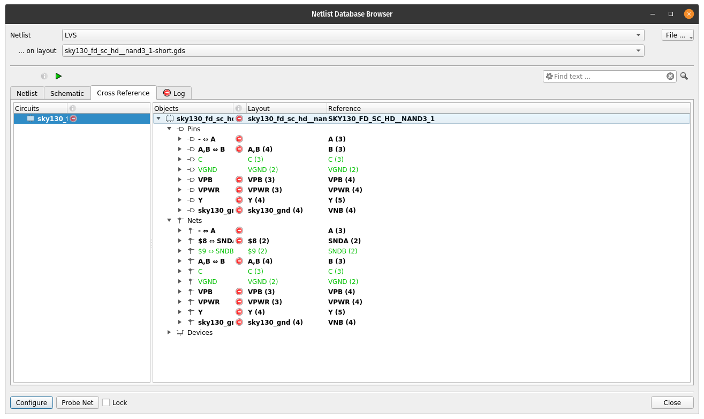
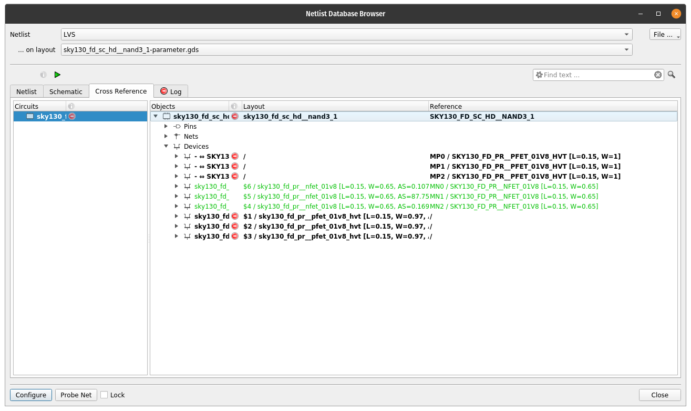
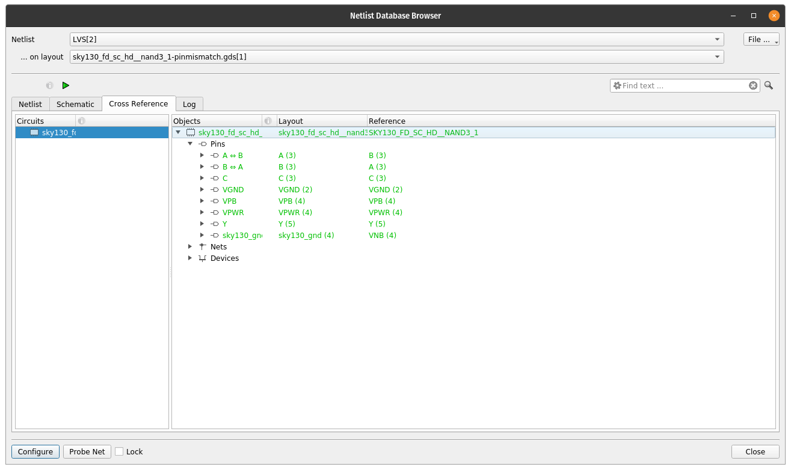

# Running LVS 

*WARNING*: Make sure you are using a DRC clean layout for this tutorial. While layouts with
DRC errors *might* work, they also might not. It depends on the DRC error.

LVS will compare a layout with a netlist in SPICE (or CDL) format. CDL is
"Cadence Description Language" and is essentially the same as SPICE. For more
understanding of SPICE syntax, take a look at the [SPICE](spice.md) tutorial.

After running LVS, you are presented with an option to import the SPICE netlist:

where you should select the SPICE netlist: ``sky130_fd_sc_hd__inv_1.spice``. 
After this, the LVS options menu will appear:

Make sure to uncheck the "scale" option in the LVS dialog box. Sky130 uses an
odd scale factor in the SPICE netlist of microns instead of meters. If you
don't uncheck this, the transistor sizes won't match and your LVS will fail.

After running LVS, you will get a window with the results like this:

The "objects" in the netlist are pins (inputs and outputs), nets (connections 
in the netlist), and devices (transistors, resistors, capacitors, etc.). In this
case, they are all green because they all match. The numbers by the nets and
the pins are the number of objects that things are connected to. For example, net
A is connected to the input pin A and the gate of both the PMOS and NMOS transistor.

If you select the "Netlist" tab in the browser, you can click on nets, pins, and
devices and they will highlight in the layout window. For example, if you click
on the "A" net, it will highlight the input pin A and the gate of the PMOS and NMOS.
This includes all of the polysilicon and the licon and li shapes for the A input.
Under "Configuration", you can also change the color and pattern of the highlighting
if it is difficult to see.

## Understanding LVS

Net and device names do not need to match in LVS. In fact, the extracted layout
names are often randomly assigned. If you look at the extracted layout you
might see names like "$3" and devices like "$6".

If you add text labels in the layout, the extraction tool will usually give the net that name.
For example, all the pins in our gates have labels like "A" and "Y" so they are given
those names. Same thing with VPWR and VGND. 

Pins, however, might need to match. This is usually a setting for the LVS tool.

Usually the hierarchy of a design will match. In other words, if you have a
SUBCKT in your netlist, you will have a layout of that too. However, this isn't
required! Sometimes, it might make sense to make an extra level of layout and
copy that to make the layout easier. LVS *should* work even if the hierarchy
doesn't match, but this depends somewhat on the LVS tool.

## Common LVS errors

There are a few common LVS errors that you might encounter and becoming an experienced engineer
will help you solve some of these. LVS is notoriously hard to debug. I've made examples using a nand3
test case for a few of them. For all of the examples, use the correct `sky130_fd_sc_hd_nand3_1.spice`
netlist. The layouts have errors in them that will cause LVS to (sometimes) fail.

You can first confirm that LVS matches the good layout `sky130_fd_sc_hd_nand3_1.gds` and you will see this:

Note that the nternal nets are named "$9" and "$10" in the layout but SNDA and
SNDB in the reference netlist. The devices are named "$1" to "$5" in the layout
but "MN1" to "MN3" and "MP1" to "MP3" in the reference netlist.

Each pin or net has a corresponding number after it which is how many things
(pins or devices) something is connected to. For example, the "A" pin is
connected to "$9" net is connected to 2 things: the drain of $5/MN1 and the
source of $6/MN0. You can also see this in the devices area where the source of
$6 is connected to $9 whereas the source of the corresponding MN0 in the
reference netlist is connected to SNDA. 

These numbers of connectiosn can help you diagnose where something is
disconnected or short circuited!

### Disconnected net

This could be a floating net due to a missing contact or via, but it could also
be a missing piece of metal that is supposed to connect two other pieces of
metal. For example, a missing wire would mean that two transistors don't get
connected. Often when you have metal that goes from a lower level to a higher
level, you need a via and piece of metal (a "via stack") to connect them. This is
usually hard to see since it is multiple overlapping shapes and can only be seen by
changing the visibility (or using the 2.5D view in KLayout!). A
disconnect can happy if a via or metal is missed at any level. Disconnected
nets will usually result in an "extra" net since each half will count as its own net. 

If you load the `sky130_fd_sc_hd_nand3_1-disconnected.gds` layout and run LVS, you should see the following:

In this case, the licon contacts for one device to the Y output are missing.
While a lot of the circuit matches, the Y output in the layout has "(3)" device
connections whereas the netlist has "(4)" device connections. This also causes the A
input to mismatch since it is connected to the $6 transistor which is
disconnected from the output. That is just a side effect though!

### Short-circuit 

This is a common error where there is an inadvertent connection. This could be
due to an extra via/contact or due to extra metal connecting two other pieces
of metal. If it is wide enough and spacing rules are satisfied, it won't cause
a DRC error!

If you load the `sky130_fd_sc_hd_nand3_1-short.gds` layout and run LVS, you should see the following:

In this example, pins A and B are connected together in the layout but not in the netlist. This is
shown with "A,B (4)" in the layout whereas the reference netlist has "B(3)" and "A(3)", separated.
Note that the only reason the layout knows it is "A,B" is because the layout has labels on the pins.
This also causes some other mismatches, but again these are just side effects.

### Missing devices

In this case, you might be entirely missing a device. This could be a missing
transistor, resistor, or capacitor. These are usually among the easiest to debug. 

### Parameter mismatch

In this case, the number of devices might match and even the number of pins and
nets could match, but the devices will be flagged with a "parameter mismatch"
due to the the W and L of the transistors not matching. Sometimes there will be
a "tolerance" that allows some deviation, but usually sizes should match
exactly. Sometimes, extraction will have other parameters like "m"
(multiplicity) that will also need to match, but there are also sometimes
options to configure how this should match parallel devices. Other extracted
parameters like AS, AD, PS, PD, etc. are usually *ignored* by LVS but it could
fail if they are not properly ignored.

If you load the layout `sky130_fd_sc_hd_nand3_1-parameter.gds` and run LVS, you should see the following:

Note that the PMOS device widths are 0.97um in the layout and 1.0um in the
SPICE netlist. The NMOS match without an error. The L of all the devices is
0.15um. If you compare with the working nand3 layout, you will see that the
bottom of the PMOS diffusion is moved up slightly and makes the width 0.97um
for all three PMOS. 

### Substrate connection

This one is a bit tricky since well and substrate taps are not always included
in each cell. Our nand3 does not have an nwell tap or substrate tap. At the
chip level, you will have your nwell connected and the pwell/substrate also
connected. However, this is usually done by the "tap" cells during placement.
At the cell level, there is usually a setting that tells LVS to connect the
wells and/or substrate to a particular name for all devices. In our LVS
settings, for example, there is the option to set the value of "lvs_sub" which
is the substrate. All three NMOS devices end up having their body connected to
"sky130_gnd". In the cell netlist, this is the "VNB" pin. But, remember, names
don't have to match! The PMOS devices are all in the same nwell, so they are
connected together automatically. If you drew separate nwells that didn't
touch, they would not be connected electrically!

### Pin mismatch

This is a common error where the pins in the layout don't match the pins in the
netlist. Whether this is flagged as an error depends on the LVS tool settings. 

If you load the `sky130_fd_sc_hd_nand3_1-pin.gds` layout and run LVS, you should see the following:

In the example, the A and B pins are swapped but LVS correctly passes. However,
notice that A in the layout matches with B in the netlist and vice versa: "A
<-> B" and "B <-> A".

### Bus flips

At higher levels, you might have a bus that is flipped. This is common when you
mix up big-endian and little-endian. For example, if you have a 4-bit bus and
the layout has the MSB on the left and the netlist has the MSB on the right,
you can run into this problem.

