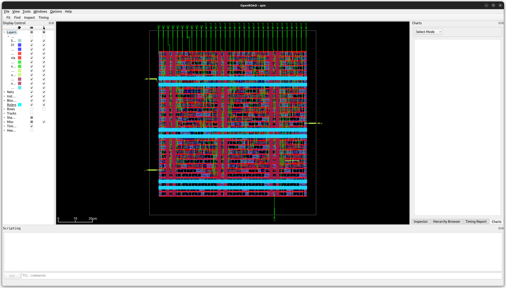

# Running an example design

This assumes that the smoke test runs and you've [installed OpenLane properly](installation.md).

You can run an example design called "SPM" by running:
```bash
openlane --run-tag foo --run-example spm
```
which will download the design, all technology files, and completely implement the design. Once
done, all of the files are in the "spm" subdirectory. The run logs and outputs of the tools are in
a directory with the current date and time like "spm/runs/RUN_2024-12-12_11-58-38".

Once you've run once, you can enter the directory and see the files:
- config.yaml: The configuration of the design.
- src: The directory with the Verilog source files.
- run: The directory containing all runs, one per directory.
- verify: The verification directory with Verilog test benches.

If you want to run again, you can specify the config file as an argument to OpenLane:
```bash
cd spm
openlane config.yaml
```

## Run directories and tags

If you want to to specify a run name like "foo", you can add the "--run-tag foo" to a command. 
This will put everything in "spm/runs/foo", but if you run again, you will either need to remove
that directory to start over, or specify "--overwrite" on the command line:
```bash
openlane --run-tag foo config.yaml
openlane --run-tag foo --overwrite config.yaml
```


## Viewing the final design

The --last-tag option is also a shortcut for the last run directory. To view the last design in
the OpenROAD GUI, you can run:
```bash
openlane --flow OpenInOpenROAD --last-tag config.yaml
```
and you should see the following:



