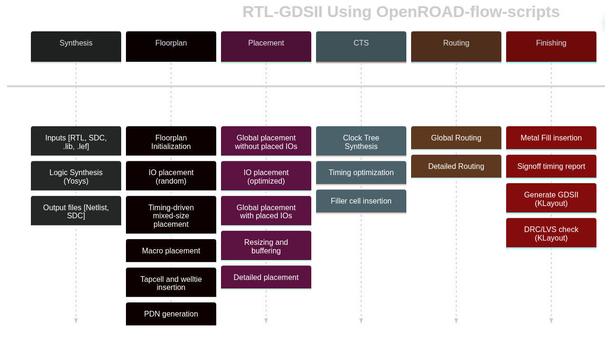

# OpenROAD Flow Scripts (ORFS) Walkthrough

## Running an example design

This assumes that the smoke test runs and you've [installed ORFS properly](orfs-installation.md).

The documentation is available at [ReadTheDocs](https://openroad.readthedocs.io/en/latest/).

The general steps of ORFS are shown here:


ORFS uses a Makefile to run the flow scripts. Specifically, it goes through the following steps that you see in the output
of a successful run:

```
Log                            Elapsed seconds Peak Memory/MB
1_1_yosys                                    0             42
1_1_yosys_canonicalize                       0             38
2_1_floorplan                                0             97
2_2_floorplan_macro                          0             93
2_3_floorplan_tapcell                        0             93
2_4_floorplan_pdn                            0             95
3_1_place_gp_skip_io                         0             94
3_2_place_iop                                0             94
3_3_place_gp                                 1            194
3_4_place_resized                            0            113
3_5_place_dp                                 0             99
4_1_cts                                      4            120
5_1_grt                                     10            213
5_2_route                                   17           1175
5_3_fillcell                                 0             97
6_1_fill                                     0             95
6_1_merge                                    1            390
6_report                                     0            137
Total                                       33           1175
```

* 1_1_yosys: logic synthesis with Yosys
* 1_1_yosys_canonicalize
* 2_1_floorplan: determines floorplan area and aspect ratio
* 2_2_floorplan_macro: places fixed size macro blocks (e.g. SRAMs)
* 2_3_floorplan_tapcell:
* 2_4_floorplan_pdn: creates power ring and/or power straps
* 3_1_place_gp_skip_io:
* 3_2_place_iop: places the IO cells around the perimeter
* 3_3_place_gp: performs global placement of the gates
* 3_4_place_resized: performs global placement timing optimization, resizing gates, buffering, etc.
* 3_5_place_dp: performs detailed placement of the gates
* 4_1_cts: performs clock tree synthesis (CTS) to build the clock tree
* 5_1_grt: performs global routing
* 5_2_route: performs detailed routing
* 5_3_fillcell: adds fill cells to row places without cells
* 6_1_fill: adds routing fill to the design
* 6_1_merge: merges the GDS of library cells into the design
* 6_report: performs final design reporting, including timing, area, and power

### Running designs/technologies

While running ```make``` ran the default design, you can pass a variable to the Makefile with a configuration file
to run other designs. The default runs this:

```
make DESIGN_CONFIG=./designs/nangate45/gcd/config.mk
```

You can implement this in the ASAP7 technology, but using this config:

```
make DESIGN_CONFIG=./designs/asap7/gcd/config.mk
```

### Viewing the final design

The --last-run option is also a shortcut for the last run directory. To view the last design in
the OpenROAD GUI, you can run:

```bash
make DESIGN_CONFIG=./designs/nangate45/gcd/config.mk gui_final
```

### Cleaning up

There are targets to clean individual steps, or the entire flow. The individual steps are:

* clean_synth
* clean_floorplan
* clean_place
* clean_cts
* clean_route
* clean_finish

The entire flow is:

* clean_all

For example, you can clean an entire design with:

```bash
make DESIGN_CONFIG=./designs/asap7/gcd/config.mk clean_all
```

### Running individual steps

You can also specify what step to run to run until with make:

```bash
make DESIGN_CONFIG=designs/<PLATFORM>/<DESIGN NAME>/config.mk <STEP>
```

where STEP can be synth, floorplan, place, cts, route or finish.

### Interactive TCL usage

To get an interactive TCL console:  

```bash
make bash DESIGN_CONFIG=designs/<PLATFORM>/<DESIGN NAME>/config.mk
openroad <TLC file>
```

This sets a bunch of environment variables so that you can use the ORFS scripts.
The bash make target sets the necessary environmental variables. This is
especially useful for using the scripts in the scripts folder of the repo. For
example you can very easily read a design in TCL with:

```tcl
source $::env(SCRIPTS_DIR)/load.tcl
load_design 4_cts.odb 4_cts.sdc
```

### Debugging OpenROAD (C++ code)

You can run openroad with gdb with

```bash
gdb --args openroad [tcl file]
```

Note, you may want to [build OR](orfs-build.md) with debug symbols enabled, however.

# Directory structure

The results (output files) are put in ```results/<techology>/<design>/base```,
where ```<technology>``` is the technology used (e.g. nangate45, asap7, etc.),
```<design>``` is the design name (e.g. gcd). The results directory is created
if it does not exist.

The log files are put in ```logs/<technology>/<design>/base```. There is one
log file per flow step.

The reports (e.g. timing, area, power) are put in
```reports/<technology>/<design>/base```. Each step has reports depending on what
it does.

## Config files

The config files contain parameters for the design, such as the technology, the
input files, the constraints, etc. The important parts of a config file
are:

```
# Specifies the technology subdirectory.
export PLATFORM    = nangate45
# Input file list (a single file or a list of files).
export VERILOG_FILES = $(DESIGN_HOME)/src/$(DESIGN_NAME)/gcd.v
# The timing constraint file.
export SDC_FILE      = $(DESIGN_HOME)/$(PLATFORM)/$(DESIGN_NAME)/constraint.sdc
# It picks a floorplan size so that the logic cells use 55\% of the area.
export CORE_UTILIZATION ?= 55
```

You can see all of the flow variable options documented here:
[Flow Variables](https://openroad-flow-scripts.readthedocs.io/en/latest/user/FlowVariables.html)

## Help

There is an [ORFS tutrorial](https://openroad-flow-scripts.readthedocs.io/en/latest/tutorials/FlowTutorial.html).

OpenROAD has some options for help via the ``man`` command like most
Unix systems. These manual pages provide detailed information about how to use
a particular command or function, along with its syntax and options.

This can be used for a range of commands in different levels as follows:

* Level 1: Top-level openroad command (e.g. ``man openroad``)
* Level 2: Individual module/TCL commands (e.g. ``man clock_tree_synthesis``)
* Level 3: Info, error, warning messages (e.g. ``man CTS-0001``)

The OpenROAD documentation is available at [ReadTheDocs](https://openroad.readthedocs.io/en/latest/).

# License

Copyright 2024 VLSI-DA (see [LICENSE](LICENSE) for use)
