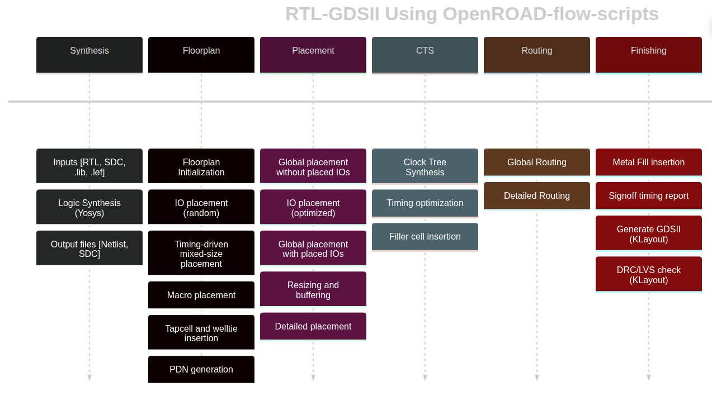

# OpenROAD Flow Scripts (ORFS) and OpenROAD

This is the single reference document for everything ORFS- and
OpenROAD-related in this repository. It covers installing the Dockerised
flow, running an example end-to-end, porting a new design, building
OpenROAD from source, and driving the OpenROAD database directly from
Python or Tcl.

## Table of contents

- [Installation](#installation)
    - [Clone ORFS](#clone-orfs)
    - [Run the Docker image](#run-the-docker-image)
    - [Common problems](#common-problems)
    - [Smoke test](#smoke-test)
    - [X11 troubleshooting](#x11-troubleshooting)
- [Walkthrough](#walkthrough)
    - [Running different designs and technologies](#running-different-designs-and-technologies)
    - [Viewing the final design](#viewing-the-final-design)
    - [Cleaning up](#cleaning-up)
    - [Running individual steps](#running-individual-steps)
    - [Interactive Tcl usage](#interactive-tcl-usage)
    - [Directory structure](#directory-structure)
    - [Config files](#config-files)
    - [Help](#help)
- [Porting a Design](#porting-a-design)
    - [Example: porting sha256](#example-porting-sha256)
- [Building from Source](#building-from-source)
    - [Clone the repository](#clone-the-repository)
    - [Docker build](#docker-build)
    - [Running the built Docker image](#running-the-built-docker-image)
    - [Local build](#local-build)
    - [Using the built OpenROAD](#using-the-built-openroad)
    - [OpenROAD regression tests](#openroad-regression-tests)
    - [Per-module regression tests](#per-module-regression-tests)
    - [Debugging OpenROAD (C++)](#debugging-openroad-c)
- [OpenROAD Python API](#openroad-python-api)
    - [Reading a design](#reading-a-design)
    - [Parasitic extraction](#parasitic-extraction)
    - [SPEF files](#spef-files)
    - [Iterating the design database](#iterating-the-design-database)
    - [Timing analysis](#timing-analysis)
    - [Discovering the API](#discovering-the-api)
- [OpenROAD Tcl API](#openroad-tcl-api)
    - [Environment](#environment)
    - [Basic Tcl](#basic-tcl)
    - [Using Tcl in OpenROAD](#using-tcl-in-openroad)
    - [Reading a design](#reading-a-design-1)
    - [OpenROAD database (ORDB)](#openroad-database-ordb)
    - [Reading ORFS step scripts](#reading-orfs-step-scripts)
    - [Further reading](#further-reading)

## Installation

The supported install path runs ORFS inside a Docker container that
Ships the pinned OpenROAD, Yosys, OpenSTA, KLayout, and other tool
binaries. You need [Docker installed](docker.md) and nothing else.

### Clone ORFS

```bash
git clone https://github.com/The-OpenROAD-Project/OpenROAD-flow-scripts.git
cd OpenROAD-flow-scripts
```

### Run the Docker image

Place the following script in the root of the cloned repo as
`runorfs.sh`:

```bash
#!/bin/bash

# Use first argument as tag if provided
if [ -n "$1" ]; then
  tag="$1"
  echo "Using user-specified tag: $tag"
else
  tag=$(git describe --tags 2>/dev/null)
  if [ -n "$tag" ]; then
    echo "Using Git tag: $tag"
  else
    echo "Warning: No tag specified and commit is not on a tag. Defaulting to 'latest'."
    tag="latest"
  fi
fi

echo "Running OpenROAD flow with tag: ${tag}"
docker run --rm -it \
  -u $(id -u ${USER}):$(id -g ${USER}) \
  -v $(pwd)/flow:/OpenROAD-flow-scripts/flow \
  -v $(pwd)/..:/OpenROAD-flow-scripts/UCSC_ML_suite \
  -e DISPLAY=${DISPLAY} \
  -v /tmp/.X11-unix:/tmp/.X11-unix \
  -v ${HOME}/.Xauthority:/.Xauthority \
  --network host \
  --security-opt seccomp=unconfined \
  openroad/orfs:${tag}
```

Make it executable:

```bash
chmod +x runorfs.sh
```

The script exports your X display so GUI applications work inside the
container and mounts `flow/` from your workspace into the image, so
designs, scripts, and results are editable from both sides.

Run the version matching your ORFS checkout, or pass an explicit tag:

```bash
# version matching your ORFS checkout
./runorfs.sh

# specific tag
git checkout v3.0-3141-gb6d79b23
./runorfs.sh v3.0-3141-gb6d79b23

# or a commit ID
git checkout 7fcc19
./runorfs.sh 7fcc19
```

### Common problems

*Beware* — your cloned version of ORFS should match the version of the
Docker image that you run. If it doesn't, command interfaces may have
diverged. `runorfs.sh` handles this automatically via `git describe
--tags`, **but only if you cloned ORFS with its full history**. A
`git clone --depth 1` will have no tags and silently fall back to
`openroad/orfs:latest`, which may not match the scripts you just cloned.
Prefer a full clone, or pass an explicit tag to `./runorfs.sh`.

Recent `openroad/orfs:latest` images are built with **AVX-512**
instructions and will crash partway through the flow with "child killed:
illegal instruction" on CPUs that do not support it (this includes most
pre-Ice-Lake Intel desktops and every Zen / Zen 2 / Zen 3 AMD part). If
you see that error, pin to an older tagged image — browse
[DockerHub tags](https://hub.docker.com/r/openroad/orfs/tags) and pass
one to `./runorfs.sh` that matches your cloned commit.

You can safely ignore the message `groups: cannot find name for group
ID 1000` when the Docker image starts.

### Smoke test

Inside the container:

```bash
I have no name!@diode:/OpenROAD-flow-scripts$ cd flow
I have no name!@diode:/OpenROAD-flow-scripts/flow$ make
```

This runs the default GCD (Greatest Common Divisor) design through the
Nangate 45 nm platform end to end. You should see a lot of output and
a final summary table (see [Walkthrough](#walkthrough) for the full
breakdown).

Note — a few `WARNING` lines are expected; any `Error` is not.

To view the final result graphically:

```bash
I have no name!@diode:/OpenROAD-flow-scripts/flow$ make gui_final
```

which should open the GCD design like this:


### X11 troubleshooting

If GUI applications inside the container fail with:

```
Authorization required, but no authorization protocol specified
Could not load the Qt platform plugin "xcb" in "" even though it was found.
```

run:

```bash
xhost +local:
```

on the host **before** you start the Docker image. This lets the
container talk to your X server.

## Walkthrough

This section assumes the [Installation](#installation) smoke test works.

The documentation is at
[OpenROAD ReadTheDocs](https://openroad.readthedocs.io/en/latest/).

The general flow steps ORFS runs are:



A successful run ends with a table like:

```
Log                        Elapsed/s Peak Memory/MB  sha1sum .odb [0:20)
1_1_yosys_canonicalize             0             38 45af71d069285cb71fba
1_2_yosys                          0             37 8f4f1609d45714b16838
1_synth                            0            102 2c0cb35f152969a57a97
2_1_floorplan                      0            121 4c0c21a703c4514a4f9e
2_2_floorplan_macro                0             98 4c0c21a703c4514a4f9e
2_3_floorplan_tapcell              0             98 41d55f307cb9baec622e
2_4_floorplan_pdn                  0            101 4b02fdf1131f9ecfb828
3_1_place_gp_skip_io              18            102 c60b97e4377b3a96d8c4
3_2_place_iop                      0            100 e10d623fff656d759c03
3_3_place_gp                      17            212 611a676ae84b63e3582b
3_4_place_resized                  0            119 611a676ae84b63e3582b
3_5_place_dp                       0            106 6f409421b824c2937041
4_1_cts                            2            128 3ae290878676cd808502
5_1_grt                           21            218 cc66d1cd20f7651b10e1
5_2_route                         25           2369 cfb6ef9f4d29c356f88b
5_3_fillcell                       0            101 e40b0e5835f90ee733e0
6_1_fill                           0             99 e40b0e5835f90ee733e0
6_1_merge                          2            424
6_report                           2            157
Total                             87           2369
```

What each step does:

* **1_1_yosys_canonicalize** — normalises the input Verilog.
* **1_2_yosys** — logic synthesis with Yosys.
* **1_synth** — post-processes the synthesised netlist for the flow.
* **2_1_floorplan** — determines floorplan area and aspect ratio.
* **2_2_floorplan_macro** — places fixed-size macro blocks (e.g. SRAMs).
* **2_3_floorplan_tapcell** — inserts tap cells.
* **2_4_floorplan_pdn** — builds the power ring and/or power straps.
* **3_1_place_gp_skip_io** — global placement excluding I/O.
* **3_2_place_iop** — places I/O cells around the perimeter.
* **3_3_place_gp** — global placement of the gates.
* **3_4_place_resized** — global-placement timing optimisation
  (resizing, buffering).
* **3_5_place_dp** — detailed placement of the gates.
* **4_1_cts** — clock tree synthesis (CTS).
* **5_1_grt** — global routing.
* **5_2_route** — detailed routing.
* **5_3_fillcell** — adds fill cells to row positions without cells.
* **6_1_fill** — adds routing fill to the design.
* **6_1_merge** — merges the GDS of library cells into the design.
* **6_report** — final design reporting (timing, area, power).

### Running different designs and technologies

`make` alone runs the default design. To pick another, pass the
design's `config.mk` via `DESIGN_CONFIG`:

```
make DESIGN_CONFIG=./designs/nangate45/gcd/config.mk
```

Same design on ASAP7:

```
make DESIGN_CONFIG=./designs/asap7/gcd/config.mk
```

The general form:

```
make DESIGN_CONFIG=designs/<PLATFORM>/<DESIGN>/config.mk
```

where `PLATFORM` is the technology (`nangate45`, `asap7`, `sky130hd`,
etc.) and `DESIGN` is the design name (`gcd`, etc.).

### Viewing the final design

```bash
make DESIGN_CONFIG=./designs/nangate45/gcd/config.mk gui_final
```

### Cleaning up

There are targets to clean individual steps or the whole flow:

* `clean_synth`
* `clean_floorplan`
* `clean_place`
* `clean_cts`
* `clean_route`
* `clean_finish`
* `clean_all`

For example:

```bash
make DESIGN_CONFIG=./designs/asap7/gcd/config.mk clean_all
```

### Running individual steps

```bash
make DESIGN_CONFIG=designs/<PLATFORM>/<DESIGN>/config.mk <STEP>
```

where `STEP` is `synth`, `floorplan`, `place`, `cts`, `route`, or
`finish`. Useful for iterating on one phase — e.g. to debug global
routing, repeat:

```bash
make DESIGN_CONFIG=designs/<PLATFORM>/<DESIGN>/config.mk clean_route
make DESIGN_CONFIG=designs/<PLATFORM>/<DESIGN>/config.mk route
```

As long as you don't touch features that affect earlier stages, this is
safe. If you modify something that changes the floorplan, clean from
`clean_floorplan` onward.

### Interactive Tcl usage

To run `openroad` interactively outside the Makefile, first set up your
`PATH` by sourcing the environment script (the Makefile does this
automatically):

```bash
source env.sh
```

Verify with:

```bash
which openroad
```

which should point to:

```
OpenROAD-flow-scripts/tools/install/OpenROAD/bin/openroad
```

For an interactive Tcl console pre-configured for a specific design:

```bash
make DESIGN_CONFIG=designs/<PLATFORM>/<DESIGN>/config.mk bash
source env.sh
openroad <tcl file>
```

`make bash` sets `SCRIPTS_DIR`, `LEF_FILES`, `LIB_FILES`, etc. so the
ORFS scripts under `flow/scripts` work. For example, to read a design
after CTS:

```tcl
source $::env(SCRIPTS_DIR)/load.tcl
load_design 4_cts.odb 4_cts.sdc
```

Because the config file specifies design and technology, you only name
the ODB and SDC.

### Directory structure

Outputs land in:

| Path                                 | Contents                                   |
|--------------------------------------|--------------------------------------------|
| `results/<PLATFORM>/<DESIGN>/base/`  | Final files (GDS, DEF, ODB, SDC, SPEF, …)  |
| `logs/<PLATFORM>/<DESIGN>/base/`     | One log per flow step                      |
| `reports/<PLATFORM>/<DESIGN>/base/`  | Per-step reports (timing, area, power, …)  |

### Config files

A config file parameterises one design in one technology. The key
variables:

```
# Specifies the technology subdirectory.
export PLATFORM    = nangate45
# Input file list (a single file or a list of files).
export VERILOG_FILES = $(DESIGN_HOME)/src/$(DESIGN_NAME)/gcd.v
# The timing constraint file.
export SDC_FILE      = $(DESIGN_HOME)/$(PLATFORM)/$(DESIGN_NAME)/constraint.sdc
# Pick a floorplan size so the logic cells use 55% of the area.
export CORE_UTILIZATION ?= 55
```

The full list of overridable variables is at
[Flow Variables](https://openroad-flow-scripts.readthedocs.io/en/latest/user/FlowVariables.html).
Many have reasonable defaults; your config only specifies what differs.
`make bash` sources the defaults followed by your config.

### Help

There is an
[ORFS tutorial](https://openroad-flow-scripts.readthedocs.io/en/latest/tutorials/FlowTutorial.html)
upstream.

OpenROAD exposes `man` pages at three levels:

* Level 1 — top-level openroad command (`man openroad`)
* Level 2 — individual module / Tcl commands (`man clock_tree_synthesis`)
* Level 3 — info / error / warning codes (`man CTS-0001`)

Documentation:

- OpenROAD: <https://openroad.readthedocs.io/en/latest/>
- ORFS: <https://openroad-flow-scripts.readthedocs.io/en/latest/>

## Porting a Design

Porting a design to ORFS is three steps:

1. Add your Verilog source to `OpenROAD-flow-scripts/flow/designs/src/<your-design>`.
2. Create a design folder and `*.sdc` / `*.mk` for each technology you
   target.
3. Update `OpenROAD-flow-scripts/flow/Makefile` to include a target for
   your design.

### Example: porting sha256

[sha256](https://github.com/secworks/sha256) is a cryptographic hash
function that can be implemented as a hardware accelerator. The RTL
lives in [this directory](https://github.com/secworks/sha256/tree/master/src/rtl).

**Add source.** Copy the RTL Verilog files to
`OpenROAD-flow-scripts/flow/designs/src/sha256`.

**Create a design config.** Assume we target `sky130hd`. Create
`OpenROAD-flow-scripts/flow/designs/sha256/`. At a minimum this folder
needs a `config.mk` (target platform, source files, flow knobs),
`constraint.sdc` (timing constraints), and a `rules-base.json` (DRC
metric checks).

#### `designs/sha256/config.mk`

The config file requires `DESIGN_NAME`, `PLATFORM`, `VERILOG_FILES`,
and `SDC_FILE`:

```
export DESIGN_NAME = sha256   # Module name of top-level instance
export PLATFORM    = sky130hd # Intended platform
export VERILOG_FILES = $(sort $(wildcard $(DESIGN_HOME)/src/$(DESIGN_NICKNAME)/*.v))
export SDC_FILE      = $(DESIGN_HOME)/$(PLATFORM)/$(DESIGN_NICKNAME)/constraint.sdc
```

*Note*: the design name `sha256` is not arbitrary. The top-level
`sha256.v` instantiates a module named `sha256`. Note the clock name as
well — it must match `constraint.sdc`.

You can add knobs like `CORE_UTILIZATION` (fraction of core area used)
or `PLACE_DENSITY` (cell density during placement). The full list is in
the
[Flow Variables](https://openroad-flow-scripts.readthedocs.io/en/latest/user/FlowVariables.html).

A more complete sha256 config:

```
export DESIGN_NICKNAME = sha256
export DESIGN_NAME = sha256
export PLATFORM    = sky130hd

export VERILOG_FILES = $(sort $(wildcard $(DESIGN_HOME)/src/$(DESIGN_NICKNAME)/*.v))
export SDC_FILE      = $(DESIGN_HOME)/$(PLATFORM)/$(DESIGN_NICKNAME)/constraint.sdc

export CORE_UTILIZATION = 40
export TNS_END_PERCENT = 100

export CTS_CLUSTER_SIZE = 25
export CTS_CLUSTER_DIAMETER = 45
```

#### (Optional) `designs/sha256/fastroute.tcl`

You can tune global routing per design. `fastroute.tcl` lets you pin
routing layers (and separate clock vs signal):

```tcl
set_global_routing_layer_adjustment $::env(MIN_ROUTING_LAYER)-$::env(MAX_ROUTING_LAYER) 0.4

set_routing_layers -clock $::env(MIN_CLK_ROUTING_LAYER)-$::env(MAX_ROUTING_LAYER)
set_routing_layers -signal $::env(MIN_ROUTING_LAYER)-$::env(MAX_ROUTING_LAYER)
```

#### `designs/sha256/constraint.sdc`

The SDC file carries clock speed and I/O timing. See
[SDC constraints](sta-constraints.md) for the syntax.

Ensure the clock name matches the top-level Verilog.

```tcl
current_design sha256

set clk_name  clk
set clk_port_name clk
set clk_period 6.5
set clk_io_pct 0.25

set clk_port [get_ports $clk_port_name]

create_clock -name $clk_name -period $clk_period $clk_port

set non_clock_inputs [lsearch -inline -all -not -exact [all_inputs] $clk_port]

set_input_delay  [expr $clk_period * $clk_io_pct] -clock $clk_name $non_clock_inputs
set_output_delay [expr $clk_period * $clk_io_pct] -clock $clk_name [all_outputs]
```

#### Update the ORFS Makefile

Append `DESIGN_CONFIG=./designs/sky130hd/sha256/config.mk` to the
Makefile, uncomment it, and run `make` to launch the flow.

### Still TODO in this tutorial

- Defining `sha256/rules-base.json`.
- Replacing a ported design's RAM with `fakeRAM`.
- Porting designs written in SystemVerilog using `SYNTH_HDL_FRONTEND` (Slang).

## Building from Source

Most users will not need to build OpenROAD from source. Prefer the
prebuilt image in [Installation](#installation) unless you need to
modify the source. You can build either inside Docker or locally. On
WSL, use the [local method](#local-build).

*BEWARE*: if you have local copies of Yosys, OpenSTA, or OpenROAD on
your `PATH`, they take priority over what's in the Docker image. If
you've taken CSE 125 / 225, you may already have Yosys installed
locally.

### Clone the repository

```bash
git clone https://github.com/The-OpenROAD-Project/OpenROAD-flow-scripts.git
cd OpenROAD-flow-scripts
```

Run all subsequent commands from the repo root unless noted otherwise.

### Docker build

The dependencies live inside the build image, so there's nothing to
install beyond [Docker](docker.md).

```bash
./build_openroad.sh
```

Docker is the default build method, so no flag is needed.

To add debug symbols when building in Docker, edit
`tools/OpenROAD/docker/Dockerfile.builder` and append CMake flags to the
build command:

```dockerfile
RUN ./etc/Build.sh -compiler=${compiler} -threads=${numThreads} -deps-prefixes-file=${depsPrefixFile} -cmake="-DCMAKE_BUILD_TYPE=DEBUG"
```

*Note*: the `--openroad-args` argument to `./build_openroad.sh` is not
forwarded to the Docker build scripts, so you can't enable debug the
same way as the local build.

### Running the built Docker image

Very similar to the ORFS Docker image used in the
[Walkthrough](#walkthrough), except you reference your locally built
image and tag (shown at the end of the build output):

```
#25 naming to docker.io/openroad/flow-ubuntu22.04-builder:6cd62b
```

A modified `runorfs.sh` (call it `runbuilder.sh`) pointing at that
image:

```bash
#!/bin/bash
TAG="${1:-latest}"
echo "Running OpenROAD flow with tag: ${TAG}"
docker run --rm -it \
  -u $(id -u ${USER}):$(id -g ${USER}) \
  -v $(pwd)/flow:/OpenROAD-flow-scripts/flow \
  -e DISPLAY=${DISPLAY} \
  -v /tmp/.X11-unix:/tmp/.X11-unix \
  -v ${HOME}/.Xauthority:/.Xauthority \
  --network host \
  --security-opt seccomp=unconfined \
  docker.io/openroad/flow-ubuntu22.04-builder:${TAG}
```

Run a specific tag:

```bash
./runbuilder.sh 6cd62b
```

### Local build

#### Dependencies

`setup.sh` installs the dependencies. You can run it wholesale if you
have root, but the three steps break down into root / non-root cleanly:

1. **(NO ROOT)** Recursively pull OpenROAD's submodules:

   ```bash
   git submodule update --init --recursive
   ```

   (You could also have cloned with `--recursive` — this is a good way
   to ensure submodules are up to date.)

2. **(ROOT)** Install system dependencies:

   ```bash
   sudo ./etc/DependencyInstaller.sh -base
   ```

   This is an ORFS-provided script. It installs the dependencies
   assuming a supported OS.

3. **(NO ROOT)** Install the other common dependencies:

   ```bash
   ./etc/DependencyInstaller.sh -common -prefix="./dependencies"
   ```

   Builds specific versions of SWIG, cmake, and so on into
   `dependencies/`.

#### Building the code

The commonly-used invocation:

```bash
source dev_env.sh
./build_openroad.sh --no_init --openroad-args "-DCMAKE_BUILD_TYPE=DEBUG" --local
```

- `source dev_env.sh` — use the tools under `./dependencies`.
- `--local` — build directly on the host, not in Docker.
- `--openroad-args` — forward CMake flags (e.g. debug build).
- `--no_init` — skip submodule re-init. Pairs well with
  `--or_repo <REPO> --or_branch <BRANCH>` when you want to compile
  against a specific OpenROAD fork/branch (default is the one ORFS
  tracks).

If you just want a vanilla local build:

```bash
./build_openroad.sh --local
```

which will update submodules to the versions this commit needs.

### Using the built OpenROAD

Set your `PATH`:

```bash
source env.sh
```

Verify:

```bash
which openroad
```

Should point to:

```
OpenROAD-flow-scripts/tools/install/OpenROAD/bin/openroad
```

### OpenROAD regression tests

Run all OpenROAD regressions (slow):

```bash
cd tools/OpenROAD/tests
./regression.sh
```

One test:

```bash
./regression gcd_nangate45
```

Or just:

```bash
openroad gcd_nangate45.tcl
```

### Per-module regression tests

Run regressions for one submodule:

```bash
cd tools/OpenROAD/src/rsz/tests
# All tests, 10 threads
./regression -j 10
# Tests matching a regex
./regression -R repair_setup
# A single regression TCL directly
openroad repair_setup1.tcl
```

Golden outputs are stored with extensions `.ok` (log), `.vok`
(Verilog), `.defok` (DEF). Regressions diff the run output against the
golden; simple diff is used unless equivalence checking is enabled.

Test outputs land under `results/`. The log is `<TEST>-tcl.log`, the
diff is `<TEST>-tcl.diff`, and the Verilog / DEF outputs (if any) are
`<TEST>_out-tcl.v` / `.def`.

### Debugging OpenROAD (C++)

```bash
gdb --args openroad [tcl file]
```

You will typically want a debug build (see above) to get useful stack
traces. The default Docker image does not include `gdb`, so you'd need
to add it (more to come).

## OpenROAD Python API

You can drive OpenROAD's database (ORDB) and timing engine from Python.
The [ASP-DAC 24
tutorial](https://github.com/ASU-VDA-Lab/ASP-DAC24-Tutorial) has many
good examples.

For the full API:

```bash
openroad -python
```

The OpenDB Python tests are a good reference:
<https://github.com/The-OpenROAD-Project/OpenDB/tree/master/tests/python>.

An example design is provided in `ordb/final.tar.gz`:

```bash
tar zxvf ordb/final.tar.gz
```

### Reading a design

```python
import openroad
from openroad import Design, Tech, Timing
import rcx
import os
import odb

openroad.openroad_version()

odb_file = "final/odb/spm.odb"
def_file = "final/def/spm.def"

lef_files = [
    "/home/mrg/.ciel/sky130A/libs.ref/sky130_fd_sc_hd/techlef/sky130_fd_sc_hd__nom.tlef",
    "/home/mrg/.ciel/sky130A/libs.ref/sky130_fd_sc_hd/lef/sky130_fd_sc_hd.lef",
]
lib_files = [
    "/home/mrg/.ciel/sky130A/libs.ref/sky130_fd_sc_hd/lib/sky130_fd_sc_hd__tt_025C_1v80.lib",
]

tech = Tech()
for lef_file in lef_files:
    tech.readLef(lef_file)
for lib_file in lib_files:
    tech.readLiberty(lib_file)

design = Design(tech)
```

Either DEF or ODB works for placement/routing:

```python
design.readDef(def_file)
design.readDb(odb_file)
```

### Parasitic extraction

You can extract from either detailed routing or global routing. The Tcl
form that selects between them:

```
estimate_parasitics
    -placement|-global_routing
    [-spef_file spef_file]
```

Detailed-routing extraction from Python:

```python
rcx.define_process_corner(ext_model_index=0, file="X")

ext_rules = "~/.ciel/sky130A/libs.tech/openlane/rules.openrcx.sky130A.nom.spef_extractor"

# NOTE: position-dependent
rcx.extract(
    ext_model_file=ext_rules,
    corner_cnt=1,
    max_res=50.0,
    coupling_threshold=0.1,
    cc_model=12,
    context_depth=5,
    debug_net_id="",
    lef_res=False,
    no_merge_via_res=False,
)
```

### SPEF files

Adjust extracted RC:

```python
rcx.adjust_rc(res_factor, cc_factor, gndc_factor)
```

Diff SPEF (Tcl):

```
diff_spef -file 31-user_project_wrapper.spef
```

Or the Python equivalent:

```python
rcx.diff_spef(
    file=spef_file,
    r_conn=False,
    r_res=False,
    r_cap=False,
    r_cc_cap=False,
)
```

### Iterating the design database

Over nets:

```python
for net in design.getBlock().getNets():
    print("**** ", net.getName())
```

Over instances (skipping filler / tap / decap):

```python
for inst in design.getBlock().getInsts():
    if "FILLER" in inst.getName():
        continue
    if "TAP" in inst.getName():
        continue
    if "decap" in inst.getMaster().getName():
        continue
    print(
        inst.getName(),
        inst.getMaster().getName(),
        design.isSequential(inst.getMaster()),
        design.isInClock(inst),
        design.isBuffer(inst.getMaster()),
        design.isInverter(inst.getMaster()),
    )
```

Over pins on an instance:

```python
for outTerm in inst.getTerms():
    if timing.isEndpoint(outTerm):
        pass
    if design.isInSupply(outTerm):
        pass
    if outTerm.isOutputSignal():
        pass
    if outTerm.isInputSignal():
        pass
```

Over library cells (masters):

```python
for lib in tech.getDB().getLibs():
    for master in lib.getMasters():
        print(master.getName())
        for mterm in master.getMTerms():
            print(" ", mterm.getName())
```

### Timing analysis

Read SDC and build a `Timing` object:

```python
design.evalTclString("read_sdc {}".format("final/spm/sdc/spm.sdc"))
timing = Timing(design)
```

Query arrival / slew / slack / capacitance:

```python
timing.getPinArrival(inTerm, Timing.Rise)
timing.getPinSlew(inTerm, Timing.Rise)
timing.getPinSlack(inTerm, Timing.Rise, Timing.Max)
timing.getNetCap(net, corner, Timing.Max)
timing.getNetCap(net, corner, Timing.Min)
```

Per-corner power:

```python
for corner in timing.getCorners():
    print(
        timing.staticPower(inst, corner),
        timing.dynamicPower(inst, corner),
    )
```

Cell timing arcs:

```python
for lib in tech.getDB().getLibs():
    for master in lib.getMasters():
        print(master.getName())
        for mterm in master.getMTerms():
            print(" ", mterm.getName())
            for m in timing.getTimingFanoutFrom(mterm):
                print("  -> ", m.getName())
```

### Discovering the API

The most reliable way to find additional methods is a runtime
`breakpoint()` + autocomplete. Set a breakpoint:

```python
for lib in tech.getDB().getLibs():
    for master in lib.getMasters():
        print(master.getName())
        for mterm in master.getMTerms():
            print(" ", mterm.getName())
            breakpoint()
```

Run your script:

```
$ openroad -python load.py
...
(Pdb)
```

At the Pdb prompt, `p mterm.get<TAB><TAB>` autocompletes visible
methods:

```
(Pdb) p mterm.get
mterm.getBBox                 mterm.getDiffArea             mterm.getMPins                mterm.getName                 mterm.getSigType
mterm.getConstName            mterm.getIndex                mterm.getMTerm                mterm.getOxide2AntennaModel   mterm.getTargets
mterm.getDefaultAntennaModel  mterm.getIoType               mterm.getMaster               mterm.getShape
```

Note that you need the `p` prefix — autocomplete does not fire on a
bare `mterm.get`.

## OpenROAD Tcl API

OpenROAD's native scripting language is Tcl. This section covers the
basics of scripting ORFS stages and driving the database interactively.

### Environment

You need [OpenROAD installed](#installation). Once running, drop into
the Tcl shell:

```
$ openroad
OpenROAD v2.0-22053-g4e2370113b
Features included (+) or not (-): +GPU +GUI +Python : DEBUG
This program is licensed under the BSD-3 license. See the LICENSE file for details.
Components of this program may be licensed under more restrictive licenses which must be honored.
openroad>
```

### Basic Tcl

Tcl is the scripting language used by most commercial and open-source
EDA tools. The basics you need to know:

- `set` — assign a value to a variable.
- `puts` — print a string.
- `expr` — evaluate an arithmetic expression.
- `proc` — define a procedure.
- `foreach` — iterate over a list.

```tcl
set a 10
set b 20
puts "The sum is: [expr $a + $b]"
```

Lists:

```tcl
set my_list [list 1 2 3 4 5]
foreach item $my_list {
    puts "Item: $item"
}
```

Procedures:

```tcl
proc greet {name greeting} {
    set msg "$greeting, $name!"
    return $msg
}

set message [greet "OpenROAD" "Hello"]
puts "Returned message: $message"
```

### Using Tcl in OpenROAD

Embed Tcl directly in scripts. The shell offers commands for design
entry, synthesis, routing, checking, etc.:

```tcl
read_lef my_design.lef
read_def my_design.def
read_liberty my_design.lib
check_timing
```

### Reading a design

An example design ships in `ordb/final.tar.gz`:

```bash
tar xvf ordb/final.tar.gz
```

Load it:

```tcl
set odb_file "final/odb/spm.odb"
set def_file "final/def/spm.def"

set lef_files {"/home/mrg/.ciel/sky130A/libs.ref/sky130_fd_sc_hd/techlef/sky130_fd_sc_hd__nom.tlef"
               "/home/mrg/.ciel/sky130A/libs.ref/sky130_fd_sc_hd/lef/sky130_fd_sc_hd.lef"}
set lib_files {"/home/mrg/.ciel/sky130A/libs.ref/sky130_fd_sc_hd/lib/sky130_fd_sc_hd__tt_025C_1v80.lib"}

foreach lef_file $lef_files {
    read_lef $lef_file
}
foreach lib_file $lib_files {
    read_liberty $lib_file
}

read_def $def_file
```

For larger setups you can lean on the ORFS
[`make bash` helpers](#interactive-tcl-usage) instead of loading
everything manually.

### OpenROAD database (ORDB)

Iterate over cells:

```tcl
set cells [get_cells]
foreach cell $cells {
    set cell_name [get_property $cell full_name]
    puts "Cell: $cell_name"
}
```

Iterate over nets:

```tcl
set nets [get_nets]
foreach net $nets {
    set net_name [get_property $net full_name]
    puts "Net: $net_name"
}
```

Query timing:

```tcl
set path [lindex [find_timing_paths -sort_by_slack -group_count 1] 0]
set slack [get_property $path slack]
puts "Critical Path Slack: $slack"
```

General property access:

```tcl
set cell [get_cells -name my_cell]
set cell_type [get_property $cell type]
puts "Cell Type: $cell_type"
```

### Reading ORFS step scripts

The ORFS flow scripts live in `flow/scripts/`. They are a good source
of idiomatic Tcl. For example, `flow/scripts/io_placement.tcl`:

```tcl
source $::env(SCRIPTS_DIR)/load.tcl
erase_non_stage_variables place

if {![env_var_exists_and_non_empty FLOORPLAN_DEF] && \
    ![env_var_exists_and_non_empty FOOTPRINT] && \
    ![env_var_exists_and_non_empty FOOTPRINT_TCL]} {
  load_design 3_1_place_gp_skip_io.odb 2_floorplan.sdc
  log_cmd place_pins \
    -hor_layers $::env(IO_PLACER_H) \
    -ver_layers $::env(IO_PLACER_V) \
    {*}$::env(PLACE_PINS_ARGS)
  write_db $::env(RESULTS_DIR)/3_2_place_iop.odb
  write_pin_placement $::env(RESULTS_DIR)/3_2_place_iop.tcl
} else {
  log_cmd exec cp $::env(RESULTS_DIR)/3_1_place_gp_skip_io.odb $::env(RESULTS_DIR)/3_2_place_iop.odb
}
```

This script sources `load.tcl`, then — after checking that no
pre-built floorplan or footprint is in effect — runs `load_design`,
`place_pins`, `write_db`, and `write_pin_placement`. If one of those
variables is set, it just copies the input ODB through. `log_cmd` is a
Tcl procedure that wraps a command so its stdout lands in the step log.

Other useful step scripts to skim: `global_place`, `resize` (timing
optimiser), `detail_place`, `cts`, `global_route`, `detailed_route`.

### Further reading

- Timing-specific Tcl commands: [STA Tutorial](sta.md).
- OpenROAD reference:
  <https://openroad.readthedocs.io/en/latest/>.

# License

Copyright 2024 VLSI-DA (see [LICENSE](LICENSE) for use)
