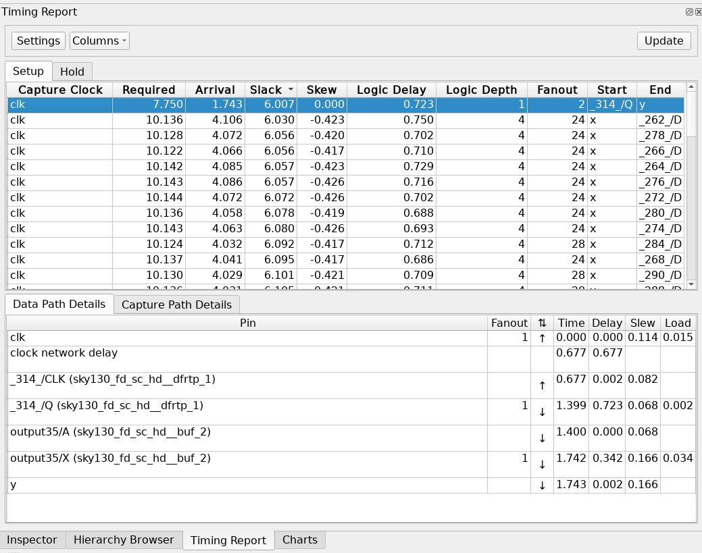

# Static Timing Analysis (STA) Tutorial

OpenSTA is a command line tool called `sta`, but it is
also integrated into OpenROAD and the [ORFS environment](orfs-installation.md):

```
$ openroad
OpenROAD edf00dff99f6c40d67a30c0e22a8191c5d2ed9d6
Features included (+) or not (-): +Charts +GPU +GUI +Python
This program is licensed under the BSD-3 license. See the LICENSE file for details.
Components of this program may be licensed under more restrictive licenses which must be honored.
warning: `/var/empty/.tclsh-history' is not writable.
openroad>
```

These tutorials all use [TCL (Tool Command
Language)](https://www.tcl.tk/man/tcl8.5/tutorial/tcltutorial.html) scripts to
interact with OpenSTA. You don't need to master TCL, but you should be familiar with
it. It is based on LISP but with customized commands for EDA tools. While you can also use
some of these commands in Python, *the industry standard is currently TCL*.

The full documentation of the OpenSTA commands can be found
[here](https://github.com/The-OpenROAD-Project/OpenSTA/blob/2c5df8ccbc09a98bd39af206339505754cbee339/doc/OpenSTA.pdf).

This tutorial will utilize the spm design example final output that was created by OpenLane2.
You should untar the file for this tutorial:

```bash
git clone https://github.com/VLSIDA/chip-tutorials.git
cd chip-tutorials
tar -zxvf final.tar.gz
```

which will create the final subdirectory with subdirectories for the different design files.
The ones that we are concerned with are the following: def, odb, nl, sdc, and spef.

This assumes that you have an environment variable pointing to your PDK installation directory. In most cases, this will be:

```bash
export PDK_ROOT=~/.ciel
```

Note that PDK_ROOT is an environment variable set in the OpenLane environment that points to the
PDK installation directory.

## Single corner timing analysis

There are four main steps to setting up a timing analysis.

1. Read in the library file(s)
1. Read in the design file(s)
1. Read in the parasitic file(s)
1. Read in the constraints

The following is an example that does each of these steps:

```tcl
read_lib $env(PDK_ROOT)/sky130A/libs.ref/sky130_fd_sc_hd/lib/sky130_fd_sc_hd__ss_100C_1v60.lib
read_db odb/spm.odb 
read_spef spef/max/spm.max.spef
read_sdc sdc/spm.sdc
```

### Other ways to read the design file(s)

Instead of reading the ODB (OpenROAD database format) file, you can use
gate-level verilog file or the DEF (Design Exchange Format) file. You may need to do this
depending on what output is available from the steps of the design flow (i.e. they don't all save ODB files). However,
these both require that you also read in the LEF technology and cell files. This would replace the
reading of the design above with these multiple steps like this for the DEF:

```tcl
read_lef $env(PDK_ROOT)/sky130A/libs.ref/sky130_fd_sc_hd/techlef/sky130_fd_sc_hd__nom.tlef
read_lef $env(PDK_ROOT)/sky130A/libs.ref/sky130_fd_sc_hd/lef/sky130_fd_sc_hd.lef
read_lef $env(PDK_ROOT)/sky130A/libs.ref/sky130_fd_sc_hd/lef/sky130_ef_sc_hd.lef
read_def def/spm.def
```

or like this for the gate-level Verilog:

```tcl
read_lef $env(PDK_ROOT)/sky130A/libs.ref/sky130_fd_sc_hd/techlef/sky130_fd_sc_hd__nom.tlef
read_lef $env(PDK_ROOT)/sky130A/libs.ref/sky130_fd_sc_hd/lef/sky130_fd_sc_hd.lef
read_lef $env(PDK_ROOT)/sky130A/libs.ref/sky130_fd_sc_hd/lef/sky130_ef_sc_hd.lef
read_verilog nl/spm.nl.v
link_design spm
```

The other steps (library files, parasitics, and constraints) are the same. Note
that with the Verilog method, the `link_design` command will report a few
missing liberty files:

```
[WARNING ORD-2011] LEF master sky130_ef_sc_hd__decap_12 has no liberty cell.
[WARNING ORD-2011] LEF master sky130_fd_sc_hd__fill_1 has no liberty cell.
[WARNING ORD-2011] LEF master sky130_fd_sc_hd__fill_2 has no liberty cell.
[WARNING ORD-2011] LEF master sky130_fd_sc_hd__tapvpwrvgnd_1 has no liberty cell.
```

but that is ok since they are special cells that do not have timing.

## Reports

The [STA Reporting Tutorial](sta-reports.md) goes into more detail on the different reports that can be generated.

## Timing Constraints

The [STA Timing Constraints Tutorial](sta-constraints.md) goes into more detail on the different constraints that can be used.

## Multi-Corner STA

The [STA Multi-Corner Tutorial](sta-mc.md) goes into more detail on how to set up a multi-corner analysis.

## Noise Analysis

TBD

## OpenROAD Timing GUI

OpenROAD has a GUI that can be used to view the timing results. You can open it
by running `openroad -gui` and running the previous commands in the "TCL Commands"
portion of OpenROAD. It is recommended
to use the ODB or DEF design files as these have the placement information.
Once you do this, click on the "Timing Report" tab and then click the "Update" button
to run the timing analysis. You should see something like this:


You can select the top ranked path (and expand the window sizes) to see the details
of the path like this:



The path should also be highlighted in the layout to see the placement. However, the color
defaults to black.

# License

Copyright 2024 VLSI-DA (see [LICENSE](LICENSE) for use)
